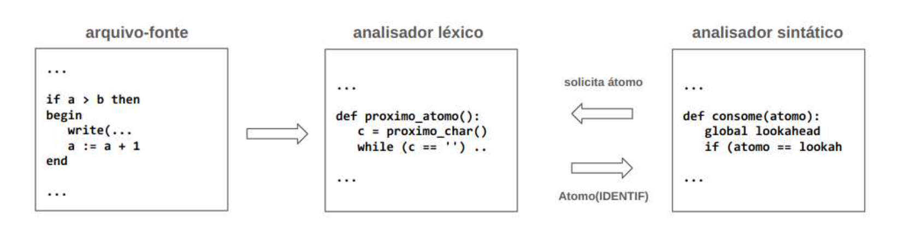

# Compiler - Lexical and Syntactic Analysis

The objective of this repository is to implement a Compiler with the lexical and syntactic analysis phases for a language based on the Pascal language, called PascalLite. The Compiler for PascalLite restricts the Pascal language to have only integer and logical **(boolean)** types, conditional statements **(if)** and repetition **(while)**. We will not implement the declaration and calls of functions in this language, the exception is the input **(read)** and output **(write)** functions implemented in a modified form.

When implementing the Compiler, the lexical analyzer must meet the needs of the syntactic analyzer. The interaction between the lexical analyzer and the syntactic analyzer will take place through the _**consume()**_ function (from the syntactic analyzer) which will make calls to the _**obtain_atomo()**_ function (from the lexical analyzer).



 &nbsp;

If you want to know more about the specifications of this project, read the job [requirements doc](./docs/requirements-doc.pdf).

## Tech Stack

<!--- # "Verify icons availability here https://github.com/tandpfun/skill-icons" -->

[](https://skillicons.dev)

## Getting Started

Add the following to gettin's started

1. **Clone project**:

```bash
git clone https://github.com/MatheusHenrique129/compiler.git
```

3. **Running the project**:

In the `src` folder, run the command:

```py
python3 compilerPascalLite.py
```

## 🤝 Collaborators ✨

✨ Special thank you for all people that contributed for this project.

<table>
  <tbody>
    <tr>
      <td align="center">
        <a href="https://github.com/Lohnii">
          <br>
          <sub>
            <b>Bruna Tiemi</b>
          </sub>
        </a>
      </td>
      <td align="center">
        <a href="https://github.com/gustavogoess">
          <br>
          <sub>
            <b>Gustavo Goes Sant`ana</b>
          </sub>
        </a>
      </td>
      <td align="center">
        <a href="https://github.com/kiq0509">
          <br>
          <sub>
            <b>Kaiky Amorim</b>
          </sub>
        </a>
      </td>
      <td align="center">
        <a href="https://github.com/MatheusHenrique129">
          <br>
          <sub>
            <b>Matheus Henrique</b>
          </sub>
        </a>
      </td>
    </tr>
  </tbody>
</table>

## 📫 Contribute

Here you will explain how other developers can contribute to your project. For example, explaining how can create their branches, which patterns to follow and how to open an pull request

1. Clone project

```bash
  git clone https://github.com/MatheusHenrique129/compiler.git
```

2. Create feature/branch:

```bash
  git checkout -b feature/NAME
```

3. Follow [commit patterns](https://gist.github.com/joshbuchea/6f47e86d2510bce28f8e7f42ae84c716).

4. Open a [Pull Request](https://www.atlassian.com/br/git/tutorials/making-a-pull-request) explaining the problem solved or feature made, if exists, append screenshot of visual modifications and wait for the review!

### Documentations that might help

- [📝 How to create a Pull Request](https://www.atlassian.com/br/git/tutorials/making-a-pull-request)
- [💾 Commit pattern](https://gist.github.com/joshbuchea/6f47e86d2510bce28f8e7f42ae84c716)

### License

This software is available under the following licenses: [MIT](https://rem.mit-license.org)
